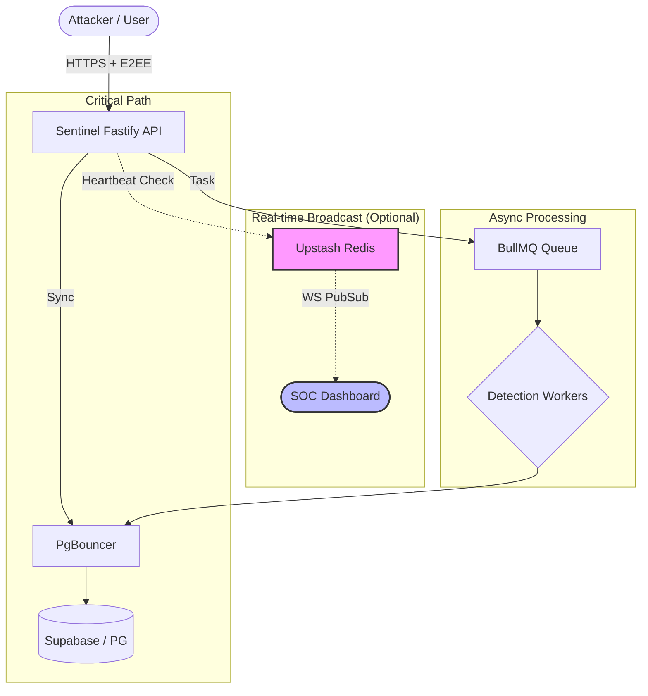

# Sentinel Core Architecture (v26.3.2)

Sentinel Core is a high-performance security telemetry engine engineered for extreme throughput and high availability.

## 🧭 System Topography

The system utilizes a decoupled microservices architecture optimized for real-time threat correlation and fail-safe persistence.

## 🛡️ Resilience Architecture (Redis Failover)

A core innovation in v26.3.2 is the **Redis Resilience Layer**. Unlike most telemetry systems that crash when the cache layer fails, Sentinel implements a **"Degraded Mode"** capability:

1. **Self-Healing Connection**: The `redisClient` utilizes a custom heartbeat and `isRedisHealthy` flag.
2. **Fail-Closed Logic**: If Upstash/Redis goes down, the API immediately bypasses the WebSocket broadcast layer to avoid hanging the request.
3. **Canonical Persistence**: Security events are ALWAYS written to PostgreSQL first. If Redis is down, the events are still safely stored—only the "Live Stream" on the dashboard is paused until connectivity is restored.
4. **Offline Queueing Disabled**: Specifically configured with `enableOfflineQueue: false` to prevent memory bloat during Redis outages.

## 🔐 Security & E2EE Layer

- **Client-Side Encryption**: Telemetry payloads are encrypted with AES-GCM-256 before hitting the API.
- **Zero-Knowledge API**: The `backend` processes metadata for risk scoring but never sees the raw sensitive content of the events.
- **Master-Org Lockdown**: Multi-tenant isolation is enforced at the DB level via `organization_id` scoping in every query.

## ⚡ Technical Foundations

1. **Horizontal Scalability**: Stateless API nodes can scale indefinitely.
2. **PgBouncer Pooling**: Ensures stable database performance under high concurrent ingestion.
3. **Fail-Fast Secrets**: Configuration engine prevents startup if production credentials are insecure.
